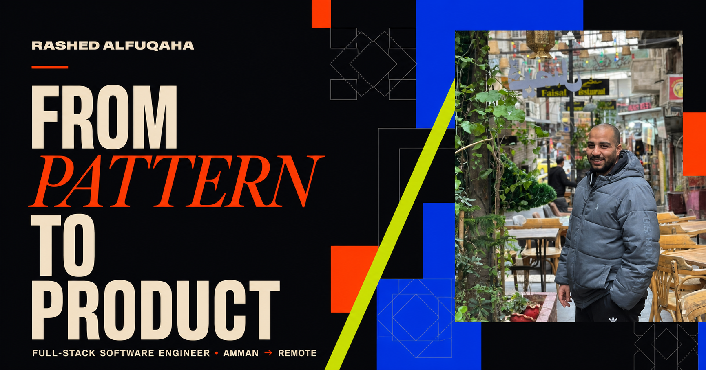

# Rashed Alfuqaha — System Atlas

A bilingual, proof-first portfolio for **Rashed Mohammad Alfuqaha**, a full-stack software engineer whose path into software began with Islamic art, architectural ornament, and CAD pattern design.

The experience treats the portfolio as a living system rather than a gallery of cards: visitors can scan the professional signal in seconds, then progressively explore project evidence, engineering decisions, AI-augmented workflow, and the design logic behind the work.



## Experience principles

- **Proof before adjectives** — projects, stack, links, and constraints appear before broad claims.
- **Progressive discovery** — the project atlas rewards exploration without hiding essential hiring information.
- **One identity, two languages** — English and Arabic are first-class experiences, including correct RTL behavior.
- **Art as engineering context** — the visual grammar connects geometric pattern thinking to reusable software systems.
- **Motion with restraint** — interaction supports orientation and curiosity, while respecting reduced-motion preferences.
- **Honest boundaries** — private repositories and confidential employer work are labeled instead of simulated.

## What is inside

- A fast first-screen signal for recruiters and collaborators
- Five project stories with verified stack and destinations
- Interactive project tabs with keyboard navigation and visit progress
- A concise AI-augmented development workflow focused on review and verification
- A visual bridge between CAD/pattern design and software architecture
- Dark and light themes with a locally remembered preference
- English and Arabic content with layout-direction switching
- Responsive layouts for desktop, tablet, and mobile
- Metadata, Open Graph image, structured data, sitemap, robots, and web manifest
- Content Security Policy and other defensive response headers

## Stack

- Vite 8 and React 19
- TypeScript
- CSS custom properties and handcrafted responsive CSS
- Node's built-in test runner for rendered-output checks

The interface deliberately avoids a heavy animation dependency. Its pattern system, state transitions, and micro-interactions are implemented with React and CSS so the concept stays fast and maintainable.

## Local development

Requirements: Node.js 22.13 or newer and pnpm.

```bash
pnpm install
pnpm dev
```

Open the local URL printed by Vite, normally `http://localhost:5173`.

## Verification

```bash
pnpm run check
pnpm test
```

The checks cover the production build, rendered portfolio content, language variants, link integrity signals, and security headers. Visual QA additionally covers desktop/mobile layouts, RTL, both themes, keyboard tab behavior, focus states, reduced-motion support, and horizontal overflow.

## Content boundaries

- Current employer work is described only at a safe, high level.
- No unverified performance metric is presented as fact.
- Public project repositories link directly to their current GitHub locations.
- Python and microservices are positioned as developing capabilities, not primary expertise.

## Deployment

The project builds as a static Vite site in `dist/` and includes a repository-owned `netlify.toml`. Netlify can publish it with `pnpm run build` and the `dist` publish directory. Canonical metadata automatically uses Netlify's production URL and can later use a personal domain through `VITE_SITE_URL`.

## Contact

- Email: [rashedmohammadalfuqaha@gmail.com](mailto:rashedmohammadalfuqaha@gmail.com)
- GitHub: [Rashedalfoqha](https://github.com/Rashedalfoqha)
- LinkedIn: [Rashed Alfuqaha](https://www.linkedin.com/in/rashedalfuqaha/)

---

Built around a simple idea: **structure was Rashed's first language; code became the next one.**
